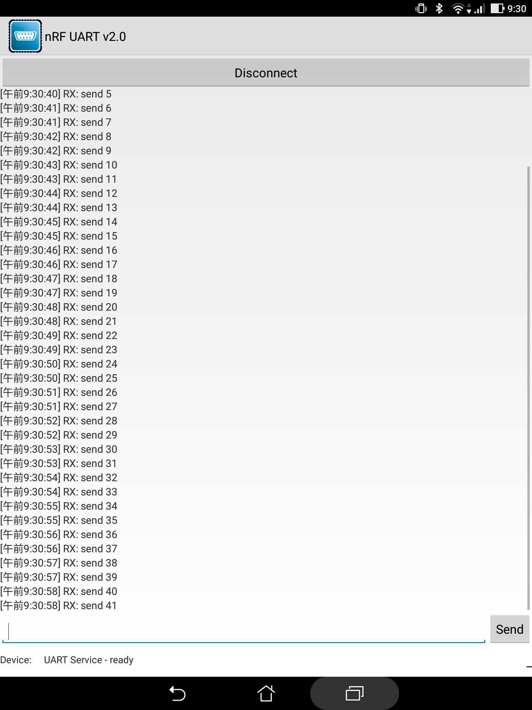

# serial_ble_converter

Converter from serial UART to Bluetooth LE UART

## Requirement
- M5Stick-C or something else esp32 device
- Arduino Version: 1.8.5
- Arduino board manager ( https://dl.espressif.com/dl/package_esp32_index.json )

## Task list in this application

|   |Core   |Job  |
|---|---|---|
|MainTask (main loop)  |core 0  |UART Receiver |
|Task0 |core 0  |BLE Transmitter |

## Demo
The demo send uart data from another ESP32 sample application( ./tools/esp32_uart_transmitter/ ) to this application. 
With Application [nRF UART 2.0](https://play.google.com/store/apps/details?id=com.nordicsemi.nrfUARTv2&hl=ja), you can view BLE UART data.

#### Hardware Connections

|M5Stick-C (UART Receiver)  |ESP32 (UART Transmitter)  |
|---|---|
|IO26  |IO27  |
|GND  |GND  |　
#### BLE UART data

　