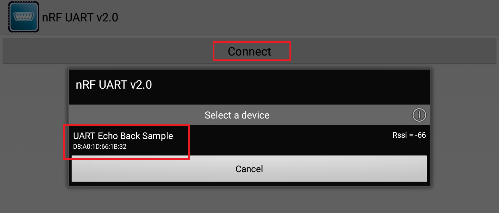
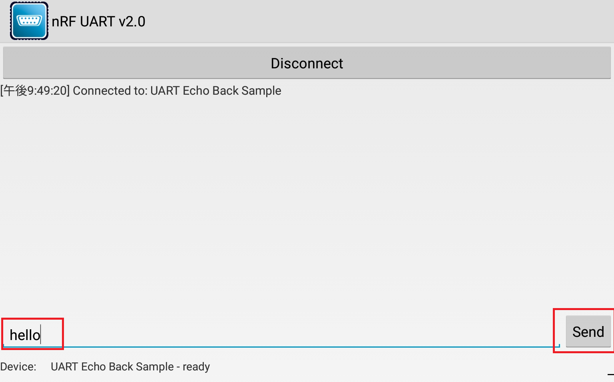
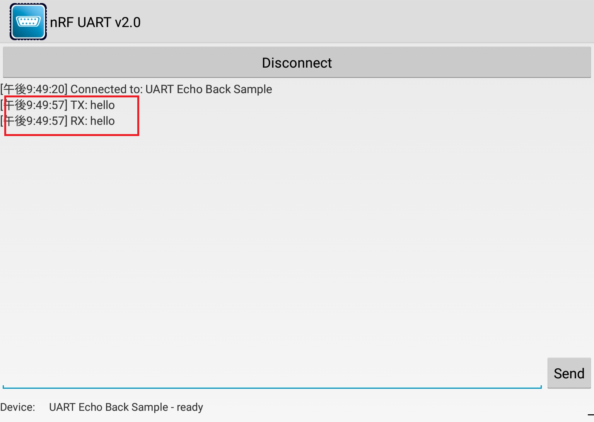

# simple_ble_echo_back

Simple echo back application with BluetoothLE UART

## Requirement

- Arduino Version: 1.8.5
- Android Application: [nRF UART 2.0](https://play.google.com/store/apps/details?id=com.nordicsemi.nrfUARTv2&hl=ja)

## Usage

1. Turn on Arduino device and Android application

1. Connect to Android device

1. Send BLE UART data  

1. Check Tx & Rx data  

